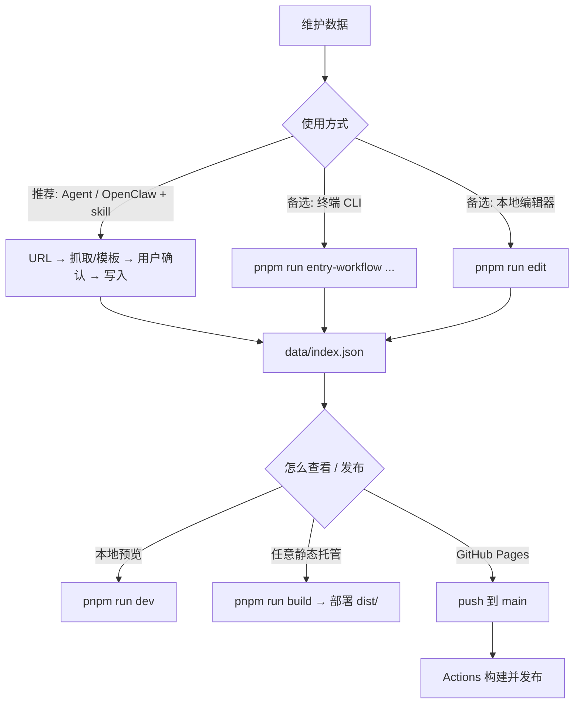

# Nav Hoard（积径）

个人网址导航：把链接、摘要和标签放在仓库里维护，构建成可部署的静态站点。

**线上地址：** [https://powdered-delta.github.io/nav-hoard/](https://powdered-delta.github.io/nav-hoard/)

## 项目是什么

- **站点**：单页导航，支持搜索、标签筛选、排序、瀑布流/列表布局、浏览器端收藏，以及可选的隐藏条目与解锁密语；界面支持中文/英文切换（条目正文不随语言翻译）。
- **数据**：规范数据源是根目录下的 `data/index.json`；维护工具会同步生成 `public/data/`，供前端读取（条目多时可能配合 `manifest.json` 与分片）。
- **工具链**：pnpm workspace，含共享类型包 `packages/types` 与本地 CLI `tools/navhoard-cli`。**日常条目的推荐维护方式**是在 **Agent / OpenClaw**（或其他支持本地 skill 的会话工具）里走「抓取 → 审阅模板 → 确认写入」主链路（见 [`docs/agent-playbook.md`](docs/agent-playbook.md) 与 [`skills/nav-hoard-entry-add/SKILL.md`](skills/nav-hoard-entry-add/SKILL.md)）；**`pnpm run entry-workflow`** 与 **`pnpm run edit`** 作为你在终端单独操作或需要批量/可视化管理时的备选。

技术栈概览：**Vite 5**、**TypeScript**、**Lit 3**（Web Components）、**MiniSearch**；可选通过 `data/config.yaml` 等配置接入抓取与 LLM 增强（示例见 `data/config.sample.yaml`）。

## 工作流程概览

从维护数据到可访问站点的大致路径如下。**推荐**以 Agent / OpenClaw 会话为主入口（底层仍使用同一套 `entry-workflow` 与数据校验）；需要时再改用 CLI 或编辑器。



## 快速开始

```bash
pnpm install
pnpm run dev          # 本地开发，端口以终端输出为准
```

生产构建会依次编译 `packages/types`、前端（`tsc` + `vite build`）以及 `tools/navhoard-cli`，产物在 `dist/`：

```bash
pnpm run build
pnpm run preview      # 可选：本地预览 dist
```

若只改 CLI、想跳过前端构建：`pnpm run build:cli`。

## 功能概览

- 搜索、多标签筛选、排序（如最新 / 相关度 / 按站点视图）
- 纯静态前端，默认可部署到 GitHub Pages 或任意静态托管
- `data/index.json` 为唯一规范数据源；`public/data/` 为运行时发布数据
- 支持 `hide: true` 的隐藏条目，以及可配置的按键序列解锁（默认密语对应经典「上上下下左右左右 BABA」序列）
- 单条与批量数据管线（`entry-workflow`、Raindrop 导入、`sources.yaml` 批量更新）；**推荐**由 Agent 会话编排，CLI 直连为备选
- 本地编辑器（备选）：新建/编辑/删除、按 URL 同步抓取、书签 HTML 导入、预览图上传等

## 目录结构

```text
nav-hoard/
├─ data/
│  ├─ index.json              # 规范数据源（single source of truth）
│  ├─ sources.yaml            # 批量抓取源配置（可选）
│  └─ config.sample.yaml      # 抓取 / 模型配置示例
├─ public/
│  ├─ data/                   # 前端运行时数据（由工具链从规范数据生成）
│  └─ nav-hoard.custom.css    # 项目级样式覆盖（推荐改这里做主题）
├─ src/                       # 前端源码（Lit 主组件等）
├─ packages/types/            # 共享类型
├─ tools/navhoard-cli/        # CLI、本地编辑器服务
├─ .github/workflows/
│  └─ deploy-pages.yml        # GitHub Pages 自动部署
├─ skills/                    # 可共享的 Agent 工作流（单条 + 批量/Raindrop）
└─ docs/                      # Agent 协作与样式等补充说明
```

## 数据约定

- **`data/index.json`**：所有录入、导入、编辑器保存的最终落点。
- **`public/data/*`**：给浏览器读的数据；不要绕过规范文件只改这里。

顶层可含 `config`（例如 `hidden_unlock_password` 用按键序列字符串配置解锁口令）。条目字段常见包括 `id`、`url`、`title`、`summary`、`tags`、`source`、`created_at`、`updated_at`，以及可选的 `hide`、`featured` 等（以类型定义与 CLI 校验为准）。

## 维护数据

| 场景 | 说明 |
| --- | --- |
| **推荐：Agent / OpenClaw 主链路** | 在会话中给出 URL 与意图，由 Agent 按 [`docs/agent-playbook.md`](docs/agent-playbook.md) 与 [`skills/nav-hoard-entry-add/SKILL.md`](skills/nav-hoard-entry-add/SKILL.md) 调用 `entry-workflow`（`capture` → 你审阅模板 → `confirm`），遵守写入前对 `summary` / `tags` 的确认约定（见根目录 [`AGENTS.md`](AGENTS.md)）。 |
| **备选：终端单条** | 本机直接执行 `pnpm run entry-workflow -- ...`（与上同一套命令，无 Agent 包装时使用）。 |
| **备选：本地可视化编辑** | `pnpm run edit`（默认 `http://127.0.0.1:3210`，可用 `--host` / `--port`），适合批量整理、书签导入、集中改字段。 |
| 按 URL 批量删除（默认 dry-run） | `pnpm run entries-remove -- --urls-from urls.txt`，确认后加 `--write` |
| **Raindrop / `sources.yaml` 批量** | 方法论（小样验证、dry-run、`config.yaml`、写后抽查）与命令摘要见 **[`skills/nav-hoard-batch-and-import/SKILL.md`](skills/nav-hoard-batch-and-import/SKILL.md)**。 |

**单条写入的典型三步（Agent 代跑或你自跑 CLI 均可）：** `capture` 生成审阅模板 → 人工确认 YAML（将 `confirm` 设为 `true`）→ `confirm` 写入 `data/index.json` 并同步 `public/data/`。首次批量/导入前可复制 `data/config.sample.yaml` 为本地 `data/config.yaml`（该文件通常在 `.gitignore` 中，用于私密 API 配置）。

OpenClaw 等工具的具体操作界面因产品而异；以本仓库 **playbook + skill + CLI** 的组合为准，保证写入路径一致。

## 样式自定义

项目会先加载内置样式，再加载 **`public/nav-hoard.custom.css`**，用于主站与本地编辑器（主站侧随构建打进产物；改完后需重新 `pnpm run build` 或通过 CI 构建，线上才会更新）。优先覆盖 `:root` 变量以统一主站与编辑器，例如：

```css
:root {
  --primary: #c084fc;
  --primary-strong: #a855f7;
  --background: #0b1020;
}
```

分层修改（何时改 `styles-base.css` / `styles-default.css` / editor 内联样式）见 **[`docs/agent-style-playbook.md`](docs/agent-style-playbook.md)**。

## 部署

- **任意静态托管**：`pnpm run build` 后部署整个 `dist/`。
- **GitHub Pages**：向 `main` 推送会触发 [`.github/workflows/deploy-pages.yml`](.github/workflows/deploy-pages.yml)。在仓库 **Settings → Pages** 中，**Build and deployment** 的 **Source** 请选择 **GitHub Actions**。工作流会为 `owner.github.io` 与普通仓库名自动设置 `VITE_BASE_PATH`（项目页为 `/仓库名/`）。

## 常用命令速查

（单条维护时，以下 `entry-workflow` 命令通常由 **Agent / OpenClaw** 在会话中代执行；也可在终端自行运行。）

```bash
pnpm install
pnpm run dev
pnpm run build
pnpm run preview
pnpm run build:cli
pnpm run edit

pnpm run entry-workflow -- capture --url "https://example.com" --write .tmp/navhoard-entry-review.yaml
pnpm run entry-workflow -- confirm --template .tmp/navhoard-entry-review.yaml

pnpm run import:raindrop -- --input export --output data/index.json --config data/config.yaml --report .tmp/raindrop-import.json
pnpm run navhoard-cli -- --sources data/sources.yaml --config data/config.yaml --output data/index.json --dry-run --report .tmp/navhoard-cli-preflight.json
pnpm run navhoard-cli -- --sources data/sources.yaml --config data/config.yaml --output data/index.json --report .tmp/navhoard-cli-apply.json
```

## License

MIT
