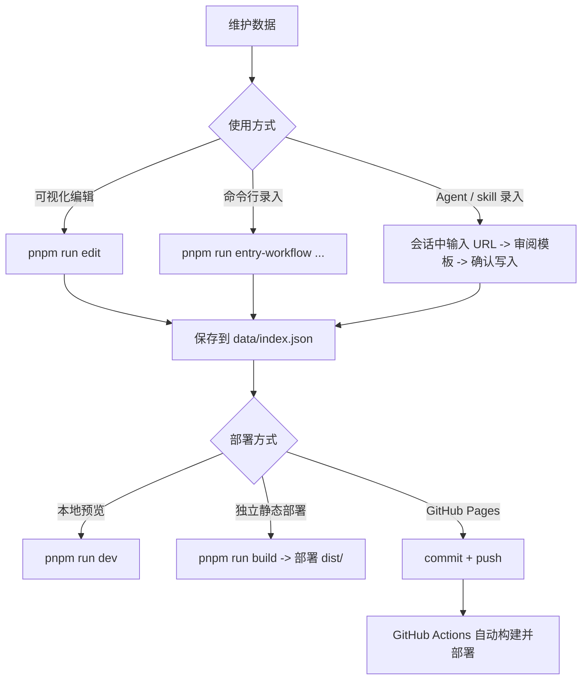

# Nav Hoard

一个轻量、可嵌入、以数据文件为中心的个人导航站项目。

它包含两部分：
- 前端站点：基于 `Vite + Lit + Web Components`
- 内容维护工具：`tools/navhoard-cli`，负责批量更新、单条录入和本地可视化编辑

适合个人项目、博客挂载页、静态导航页，以及“把内容放在仓库里维护”的工作流。

## TL;DR

给有基础的开发者的最短使用路径：

```bash
pnpm install
pnpm run navhoard-cli:build
pnpm run build
```

常用命令：
- 启动前端开发：`pnpm run dev`
- 启动本地可视化编辑器：`pnpm run edit`
- 导入 Raindrop 导出：`pnpm run import:raindrop -- --input export --output data/index.json`
- 自定义样式覆盖：编辑 `public/nav-hoard.custom.css`

典型流程：



部署方式可以这样理解：
- 只想本地查看效果：`pnpm run dev`
- 想部署到任意静态托管：`pnpm run build` 后上传 `dist/`
- 想用 GitHub Pages：本地改完后 `commit + push`，交给 Actions 自动部署

## Agent 工作流约定

如果你使用的是支持本地 skill / prompt / 会话工作流的 Agent（例如龙虾这类工具），建议遵循下面这条固定链路：

更适合 Agent 直接读取的独立说明见：`docs/agent-playbook.md`

1. Agent 帮你录入或修改条目
2. 变更统一保存到 `data/index.json`
3. 本地验证：
   - 只看页面效果：`pnpm run dev`
   - 检查构建是否正常：`pnpm run build`
4. 确认无误后执行 `commit`
5. `push` 到 `main`
6. GitHub Actions 自动构建并部署到 GitHub Pages

边界约定：
- `pnpm run edit` 是**本地维护工具**，不属于线上部署产物
- `dist/` 是构建输出，不作为人工维护入口
- Agent 可以帮助完成录入、校验、构建、整理提交说明
- 是否执行 `git commit` / `git push`，建议由用户明确确认后再执行
- 如果 GitHub Pages 尚未启用，Agent 应停在提示阶段，引导用户先完成仓库设置

对 Agent 来说，最重要的几个固定事实是：
- 唯一规范数据源：`data/index.json`
- 前端发布数据目录：`public/data/`
- 本地编辑入口：`pnpm run edit`
- 自动部署入口：`push` 到 `main`

### 给 Agent 的 Checklist

- 先确认本次目标是：录入条目、编辑数据，还是准备部署
- 所有内容修改统一落到 `data/index.json`
- 如需人工维护，优先使用 `pnpm run edit`
- 如需本地验证，优先执行：
  - `pnpm run dev`（看页面效果）
  - `pnpm run build`（看构建是否通过）
- 不要把 `edit` 当成部署产物的一部分
- 不要直接修改 `dist/`
- 在执行 `git commit` 或 `git push` 前，先征得用户确认
- 若仓库未启用 GitHub Pages / Actions，只提示用户配置，不擅自假设已启用
- 若用户选择 GitHub Pages 方案，则默认部署入口是：`push` 到 `main`

## 功能概览

- 单页导航站，支持搜索、标签筛选、游客本地收藏
- 前端纯静态部署，默认可部署到 GitHub Pages
- `data/index.json` 作为唯一规范数据源
- `public/data/` 作为前端运行时发布数据目录
- 支持 `hide: true` 的隐藏条目，以及通过全局按键密语解锁显示
- 支持批量抓取更新
- 支持单条 URL 的抓取、审阅、确认写入
- 支持本地可视化编辑器：新建、编辑、删除、保存、同步抓取、导入书签

## 技术栈

- 前端：`Lit 3`、`MiniSearch`
- 构建：`Vite 5`、`TypeScript`
- 内容维护：`tools/navhoard-cli`
- 部署：`GitHub Actions + GitHub Pages`

## 目录结构

```text
nav-hoard/
├─ data/
│  ├─ index.json              # 规范数据源（single source of truth）
│  ├─ sources.yaml            # 批量抓取源配置
│  └─ config.sample.yaml      # 抓取 / 模型配置示例
├─ public/
│  ├─ data/                   # 前端运行时数据（由 data/index.json 发布生成）
│  └─ nav-hoard.custom.css    # 自定义样式覆盖入口
├─ src/                       # 前端源码
├─ tools/
│  └─ navhoard-cli/           # 数据维护工具、本地编辑器
├─ .github/
│  └─ workflows/
│     └─ deploy-pages.yml     # GitHub Pages 自动部署
└─ README.md
```

## 数据约定

### 规范数据源

- 项目唯一规范数据源是 `data/index.json`
- 不论是批量更新、单条录入，还是本地编辑器保存，最终都写入这个文件

示例：

```json
{
  "version": "0.2",
  "updated_at": "2026-03-11T00:00:00.000Z",
  "config": {
    "hidden_unlock_password": "up up down down left right left right b a b a"
  },
  "entries": [
    {
      "id": "abc123def456",
      "url": "https://example.com",
      "title": "Example",
      "summary": "Example summary",
      "tags": ["Example", "工具"],
      "source": "example.com",
      "hide": true,
      "created_at": "2026-03-11T00:00:00.000Z",
      "updated_at": "2026-03-11T00:00:00.000Z"
    }
  ]
}
```

### 前端发布数据

- 前端默认从 `public/data/` 读取运行时数据
- 条目较少时可直接读取 `index.json`
- 条目较多时会读取 `manifest.json` 与分片数据
- 顶层 `config.hidden_unlock_password` 可配置隐藏条目的解锁密语
- 条目级 `hide: true` 表示默认不在主页面展示，用户按出正确的按键序列后才显示
- 默认密语对应按键序列：上、上、下、下、左、右、左、右、B、A、B、A
- 自定义密语支持直接写成按键序列字符串，例如：`"up up down down left right left right b a b a"`、`"↑ ↑ ↓ ↓ ← → ← → B A B A"`、`"上 上 下 下 左 右 左 右 B A B A"`
- 字母按键匹配不区分大小写

也就是说：
- `data/index.json`：内容维护的真实来源
- `public/data/*`：给前端读取的发布产物

## 本地开发

### 1. 安装依赖

```bash
pnpm install
```

### 2. 启动前端开发服务器

```bash
pnpm run dev
```

默认访问：`http://localhost:3000`

### 3. 构建前端

```bash
pnpm run build
```

构建产物输出到 `dist/`

### 4. 本地预览生产构建

```bash
pnpm run preview
```

## 内容维护

### 先构建 `navhoard-cli`

首次使用前建议先构建工具：

```bash
pnpm run navhoard-cli:build
```

## 批量更新数据

如果已经配置好了 `data/sources.yaml` 和本地 `data/config.yaml`：

```bash
pnpm run navhoard-cli -- --sources data/sources.yaml --config data/config.yaml --output data/index.json

pnpm run import:raindrop -- --input export --output data/index.json --config data/config.yaml
pnpm run import:raindrop -- --input .tmp/raindrop-sample.csv --output data/index.json --config data/config.yaml --llm-enhance
```

首次使用可先复制示例配置：

```bash
# macOS / Linux
cp data/config.sample.yaml data/config.yaml

# Windows PowerShell
Copy-Item data/config.sample.yaml data/config.yaml

# Windows CMD
copy data\\config.sample.yaml data\\config.yaml
```

`data/config.yaml` 已加入 `.gitignore`，用于存放你自己的本地模型配置。

这条链路会：
- 读取抓取源配置
- 拉取并归一化条目
- 合并写入 `data/index.json`
- 同步生成 `public/data/` 下的前端数据

## 导入 Raindrop 导出

如果你已经从 Raindrop.io 导出了 `export.csv` 或整个 `export/` 目录，可以直接导入到当前项目。

### 推荐流程

1. 先复制本地配置：

```bash
# macOS / Linux
cp data/config.sample.yaml data/config.yaml

# Windows PowerShell
Copy-Item data/config.sample.yaml data/config.yaml

# Windows CMD
copy data\\config.sample.yaml data\\config.yaml
```

2. 先跑小样本，确认抓取与 LLM 配置可用：

```bash
pnpm run import:raindrop -- --input .tmp/raindrop-sample.csv --output data/index.json --config data/config.yaml --llm-enhance
```

3. 小样本确认无误后，再跑全量：

```bash
pnpm run import:raindrop -- --input export --output data/index.json --config data/config.yaml --llm-enhance
```

### 导入模式

- 普通导入：保留 Raindrop 原始字段，并尝试抓取站点内容补全标题、摘要、预览图
- LLM 增强导入：在抓取结果基础上，继续生成或优化标签
- 抓取失败回退：站点抓取失败时自动回退到 CSV 原始字段，不会中断整批导入
- 标签合并：保留原始 tags，并与抓取 / LLM 结果合并

### 常用命令

普通导入：

```bash
pnpm run import:raindrop -- --input export --output data/index.json --config data/config.yaml
```

导入并启用 LLM 标签增强：

```bash
pnpm run import:raindrop -- --input export --output data/index.json --config data/config.yaml --llm-enhance
```

只导入 CSV，不做站点抓取：

```bash
pnpm run import:raindrop -- --input export --output data/index.json --config data/config.yaml --no-fetch
```

## 单条链接录入

### 方式一：命令行工作流

#### 第 1 步：抓取 URL 并生成审阅模板

```bash
pnpm run entry-workflow -- capture --url "https://example.com" --write .tmp/navhoard-entry-review.yaml
```

默认规则：
- 只要是“指定 URL / 指定站点 / 指定条目”的新增、纠错、补摘要、修乱码、改标签，都先走这条 CLI 工作流
- 不要把直接手改 `data/index.json` 当成首选方案
- 如果在线抓取失败，仍然要继续使用审阅模板，人工补齐字段后再确认写入
- 如果用户要求的是“更新已有条目”，且新结果相对现有数据出现大幅描述变更，或存在明显的 tag 增删，先向用户确认，再执行最终写入

这一步会：
- 尝试抓取并提取页面内容
- 生成统一的审阅模板
- 把模板写入 `.tmp/navhoard-entry-review.yaml`

#### 第 2 步：编辑模板

打开 `.tmp/navhoard-entry-review.yaml`，检查并修改：
- `title`
- `summary`
- `tags`
- `source`
- `confirm`

注意：
- 抓取成功时，模板里会包含自动提取结果
- 抓取失败时，也会返回一个可编辑模板
- 真正写入前，必须把 `confirm: false` 改成 `confirm: true`

#### 第 3 步：可选，先解析模板不写入

```bash
pnpm run entry-workflow -- parse --template .tmp/navhoard-entry-review.yaml
```

#### 第 4 步：确认并写入数据源

```bash
pnpm run entry-workflow -- confirm --template .tmp/navhoard-entry-review.yaml
```

这一步会：
- 解析你修改后的模板
- 校验字段
- 归一化 URL
- 与现有数据去重合并
- 写入 `data/index.json`
- 同步生成 `public/data/` 发布产物

补充说明：
- 默认不传 `--output`，会直接写入仓库根目录下的 `data/index.json`，并同步 `public/data/index.json`
- 如果确实要覆盖输出路径，优先传仓库根目录的绝对路径；不要依赖相对 `--output data/index.json`

### 方式二：通过 skill / 会话能力模板

仓库中保留了可复用的 skill 模板，可用于支持本地 skill / prompt 工作流的 Agent。

你可以在会话里直接说类似的话：
- “帮我给 NavHoard 添加一个新条目”
- “为这个项目录入一个链接”
- “抓取这个 URL，生成模板让我确认后再写入”

典型流程是：
1. 输入 URL
2. 抓取内容
3. 返回统一模板
4. 手动修订并确认
5. 写入 `data/index.json`
6. 继续本地验证或提交仓库

### 方式三：本地可视化编辑器

这是当前推荐的人工维护入口：

```bash
pnpm run edit
```

默认访问：`http://127.0.0.1:3210`

如需开放局域网访问，可使用：

```bash
pnpm run edit -- --host 0.0.0.0
```

也支持同时指定端口：

```bash
pnpm run edit -- --host 0.0.0.0 --port 3210
```

#### 编辑器当前支持

- 搜索现有条目
- 新建、编辑、删除条目
- 点击“同步”后根据 URL 自动抓取并回填标题、摘要、标签、来源
- 上传预览图到 `public/images/previews/`
- 导入浏览器书签 HTML
- 标记 / 取消“作者推荐（置顶）”
- 只看置顶条目
- 保存时统一执行归一化、去重、校验与发布
- 抓取时兼容常见中文页面编码（如 `UTF-8`、`GBK`、`GB18030`）

#### 编辑器说明

- 左右两栏独立滚动，适合长列表和长表单同时操作
- `pnpm run edit` 运行的是开发态编辑器，修改 editor 相关源码后会自动刷新
- `edit` 是本地维护工具，不参与线上部署产物
- 编辑器列表默认严格按 `created_at` 倒序排列
- 置顶条目仅作为标记与筛选条件，不会在编辑器列表中自动上浮

## 样式自定义

如果要让 Agent 参与改样式，建议同时阅读：`docs/agent-style-playbook.md`

项目默认会先加载内置基础样式，再加载：

```text
public/nav-hoard.custom.css
```

这个文件同时作用于：
- 主站前端
- 本地编辑器

推荐优先在 `:root` 上覆盖通用变量，这样主站和 editor 都能复用，例如：

```css
:root {
  --primary: #c084fc;
  --primary-strong: #a855f7;
  --primary-soft: rgba(192, 132, 252, 0.14);
  --background: #0b1020;
  --max-width: 1240px;
}
```

如果只想覆盖主站，也可以继续写 `nav-hoard { ... }`；如果只是项目级个性化定制，优先放在 `public/nav-hoard.custom.css`，不要把默认样式逻辑反向塞回这里。

## 部署到 GitHub Pages

项目已接入 GitHub Actions 工作流：

- `.github/workflows/deploy-pages.yml`

### 工作流行为

当你把代码 push 到 `main` 时，工作流会自动：
1. 安装依赖
2. 自动计算 `VITE_BASE_PATH`
3. 执行 `pnpm run build`
4. 上传 `dist/`
5. 发布到 GitHub Pages

### 第一次启用 Pages

在 GitHub 仓库中：
1. 打开 `Settings`
2. 进入 `Pages`
3. 在 `Source` 中选择 `GitHub Actions`

### Base Path 说明

工作流会自动区分两种 Pages 场景：
- 用户 / 组织首页仓库：`owner.github.io` → `VITE_BASE_PATH=/`
- 项目页仓库：`repo-name` → `VITE_BASE_PATH=/repo-name/`

通常不需要手动修改 `vite.config.ts`

## 作为独立静态站使用

```bash
pnpm run build
```

然后把 `dist/` 部署到任意静态托管平台即可。

## 常用命令速查

```bash
pnpm install
pnpm run dev
pnpm run build
pnpm run preview

pnpm run navhoard-cli:build
pnpm run navhoard-cli -- --sources data/sources.yaml --config data/config.yaml --output data/index.json
pnpm run import:raindrop -- --input export --output data/index.json --config data/config.yaml
pnpm run import:raindrop -- --input .tmp/raindrop-sample.csv --output data/index.json --config data/config.yaml --llm-enhance

pnpm run entry-workflow -- capture --url "https://example.com" --write .tmp/navhoard-entry-review.yaml
pnpm run entry-workflow -- parse --template .tmp/navhoard-entry-review.yaml
pnpm run entry-workflow -- confirm --template .tmp/navhoard-entry-review.yaml --output data/index.json

pnpm run edit
```

## 当前进度

- [x] 前端导航页 MVP
- [x] 规范数据路径统一
- [x] 单条抓取草稿管线
- [x] 统一审阅模板与确认写入
- [x] skill / 会话录入工作流
- [x] GitHub Pages 自动部署
- [x] 本地可视化编辑器（`pnpm run edit`）
- [ ] 仓库提交检查与更完整的自动提交流程

## License

MIT
